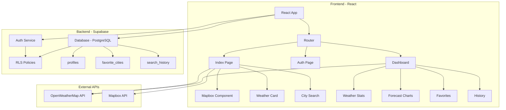
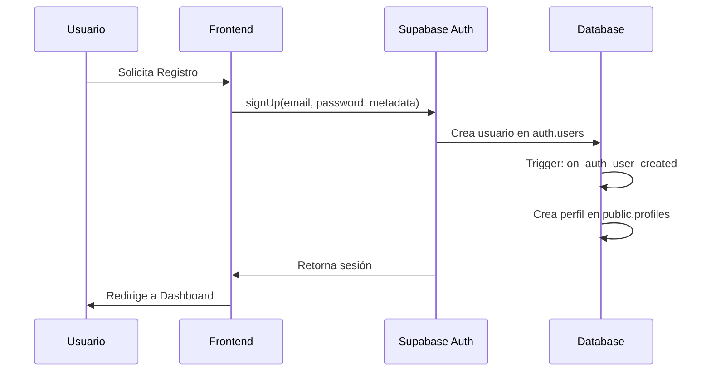
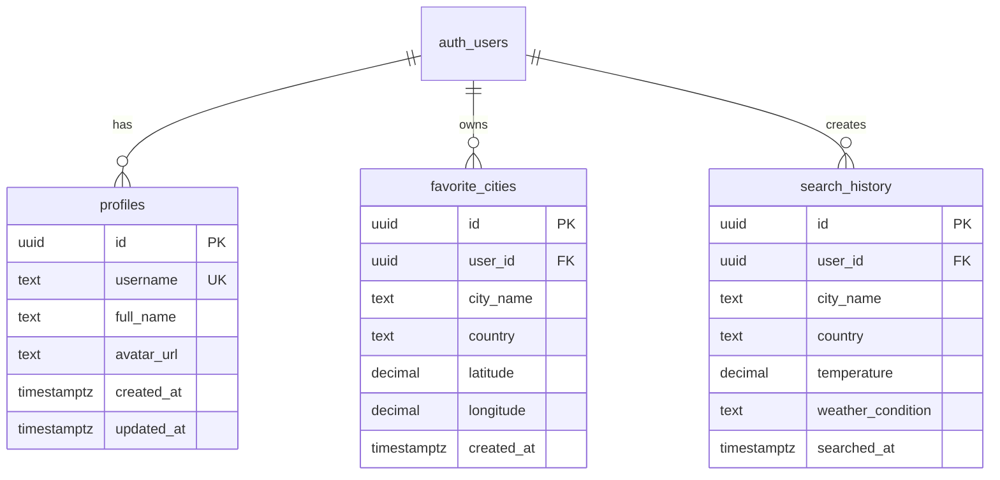
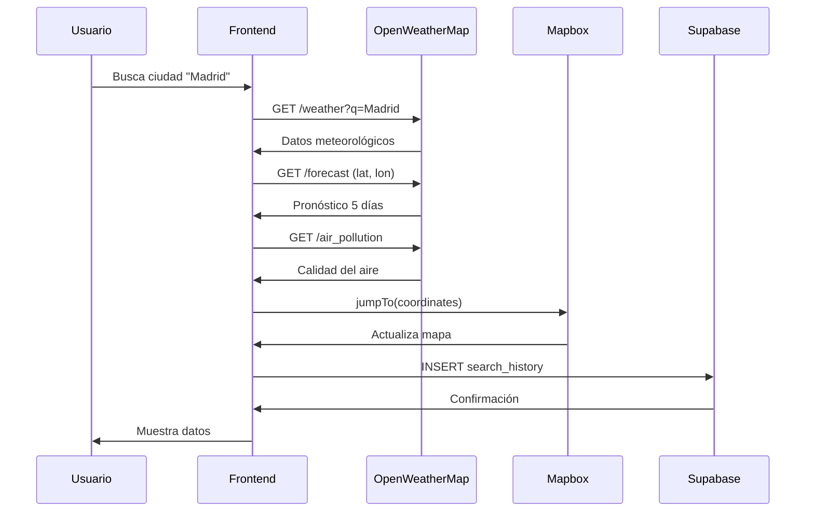

# 🌍 Aura Global - Sistema Meteorológico Avanzado

## 📋 Tabla de Contenidos
- [Descripción General](#descripción-general)
- [Arquitectura del Sistema](#arquitectura-del-sistema)
- [Características Principales](#características-principales)
- [Stack Tecnológico](#stack-tecnológico)
- [Base de Datos](#base-de-datos)
- [APIs Utilizadas](#apis-utilizadas)
- [Estructura del Proyecto](#estructura-del-proyecto)
- [Instalación y Configuración](#instalación-y-configuración)
- [Funcionalidades Técnicas](#funcionalidades-técnicas)
- [Seguridad](#seguridad)

---

## 🎯 Descripción General

**Aura Global** es una aplicación web meteorológica avanzada que proporciona información climática en tiempo real con capacidades de visualización interactiva mediante un globo terráqueo 3D. El sistema integra autenticación de usuarios, gestión de favoritos, historial de búsquedas y análisis meteorológico técnico.

### Características Clave
- 🗺️ Visualización de mapa global interactivo con Mapbox
- 🌦️ Datos meteorológicos en tiempo real
- 📊 Análisis técnico avanzado del clima
- 📈 Pronósticos con gráficos interactivos
- 👤 Sistema de autenticación completo
- ⭐ Gestión de ciudades favoritas
- 📝 Historial de búsquedas persistente
- 🌓 Modo oscuro/claro

---

## 🏗️ Arquitectura del Sistema



---

## ✨ Características Principales

### 1. Visualización Geográfica
- **Globo interactivo 3D** con rotación automática
- **Capa de nubes en tiempo real** superpuesta
- **Zoom y navegación** fluida
- **Proyección esférica** realista

### 2. Datos Meteorológicos

#### Datos Básicos
| Métrica | Descripción | Unidad |
|---------|-------------|--------|
| Temperatura | Temperatura actual | °C |
| Sensación Térmica | Temperatura percibida | °C |
| Temp. Mínima/Máxima | Rango del día | °C |
| Humedad | Humedad relativa | % |
| Presión Atmosférica | Presión barométrica | hPa |

#### Datos Técnicos Avanzados
| Métrica | Descripción | Unidad |
|---------|-------------|--------|
| Punto de Rocío | Temperatura de condensación | °C |
| Visibilidad | Alcance visual | km |
| Velocidad del Viento | Intensidad del viento | km/h |
| Dirección del Viento | Dirección cardinal | grados |
| Índice UV | Radiación ultravioleta | 0-11+ |
| Nubosidad | Cobertura de nubes | % |
| Probabilidad de Lluvia | Chance de precipitación | % |
| Calidad del Aire | AQI (Air Quality Index) | 0-500 |

### 3. Sistema de Autenticación



### 4. Dashboard Técnico

El dashboard incluye 5 secciones principales:

1. **Favoritos**: Gestión de ciudades guardadas
2. **Clima Técnico**: Métricas meteorológicas avanzadas
3. **Pronóstico**: Gráficos de previsión 24h
4. **Historial**: Últimas 10 búsquedas
5. **Perfil**: Configuración de usuario

---

## 🛠️ Stack Tecnológico

### Frontend
```json
{
  "framework": "React 18.3.1",
  "router": "React Router DOM 6.30.1",
  "styling": "Tailwind CSS",
  "ui-components": "Radix UI + shadcn/ui",
  "maps": "Mapbox GL 3.16.0 + react-map-gl 7.1.9",
  "charts": "Recharts 2.15.4",
  "forms": "React Hook Form 7.61.1",
  "validation": "Zod 3.25.76",
  "state": "TanStack Query 5.83.0"
}
```

### Backend
```json
{
  "database": "PostgreSQL (Supabase)",
  "auth": "Supabase Auth",
  "realtime": "Supabase Realtime",
  "orm": "@supabase/supabase-js 2.81.1"
}
```

### APIs Externas
- **OpenWeatherMap API**: Datos meteorológicos
  - Current Weather Data
  - 5 Day / 3 Hour Forecast
  - Air Pollution API
- **Mapbox API**: Visualización de mapas

---

## 🗄️ Base de Datos

### Esquema de Tablas



### Políticas RLS (Row Level Security)

#### profiles
```sql
-- Lectura: Todos pueden ver perfiles
CREATE POLICY "Public profiles are viewable by everyone"
  ON public.profiles FOR SELECT
  USING (true);

-- Inserción: Solo el propio usuario
CREATE POLICY "Users can insert their own profile"
  ON public.profiles FOR INSERT
  WITH CHECK (auth.uid() = id);

-- Actualización: Solo el propio usuario
CREATE POLICY "Users can update own profile"
  ON public.profiles FOR UPDATE
  USING (auth.uid() = id);
```

#### favorite_cities
```sql
-- Solo el usuario puede ver sus favoritos
CREATE POLICY "Users can view their own favorites"
  ON public.favorite_cities FOR SELECT
  USING (auth.uid() = user_id);

-- Solo el usuario puede insertar sus favoritos
CREATE POLICY "Users can insert their own favorites"
  ON public.favorite_cities FOR INSERT
  WITH CHECK (auth.uid() = user_id);

-- Solo el usuario puede eliminar sus favoritos
CREATE POLICY "Users can delete their own favorites"
  ON public.favorite_cities FOR DELETE
  USING (auth.uid() = user_id);
```

#### search_history
```sql
-- Mismas políticas que favorite_cities
-- Acceso restringido al propio usuario
```

### Triggers y Funciones

#### handle_new_user()
```sql
CREATE FUNCTION public.handle_new_user()
RETURNS TRIGGER AS $$
BEGIN
  INSERT INTO public.profiles (id, username, full_name, avatar_url)
  VALUES (
    NEW.id,
    COALESCE(NEW.raw_user_meta_data->>'username', split_part(NEW.email, '@', 1)),
    COALESCE(NEW.raw_user_meta_data->>'full_name', ''),
    COALESCE(NEW.raw_user_meta_data->>'avatar_url', '')
  );
  RETURN NEW;
END;
$$ LANGUAGE plpgsql SECURITY DEFINER;
```

**Propósito**: Crea automáticamente un perfil cuando un usuario se registra.

#### handle_updated_at()
```sql
CREATE FUNCTION public.handle_updated_at()
RETURNS TRIGGER AS $$
BEGIN
  NEW.updated_at = NOW();
  RETURN NEW;
END;
$$ LANGUAGE plpgsql;
```

**Propósito**: Actualiza automáticamente el timestamp `updated_at`.

---

## 📡 APIs Utilizadas

### OpenWeatherMap API

#### Current Weather Data
```typescript
GET https://api.openweathermap.org/data/2.5/weather
  ?q={city_name}
  &appid={API_KEY}
  &units=metric
  &lang=es
```

**Respuesta incluye**:
- Temperatura actual, mínima, máxima
- Sensación térmica
- Presión atmosférica
- Humedad
- Visibilidad
- Velocidad y dirección del viento
- Nubosidad
- Amanecer y atardecer

#### 5 Day Forecast
```typescript
GET https://api.openweathermap.org/data/2.5/forecast
  ?lat={latitude}
  &lon={longitude}
  &appid={API_KEY}
  &units=metric
  &lang=es
```

**Datos cada 3 horas** para 5 días:
- Temperatura
- Probabilidad de precipitación (PoP)
- Humedad
- Viento

#### Air Pollution API
```typescript
GET https://api.openweathermap.org/data/2.5/air_pollution
  ?lat={latitude}
  &lon={longitude}
  &appid={API_KEY}
```

**Índice de Calidad del Aire (AQI)**:
- 1: Bueno
- 2: Aceptable
- 3: Moderado
- 4: Malo
- 5: Muy Malo

### Mapbox API

```typescript
mapboxgl.accessToken = 'pk.eyJ1...'
new mapboxgl.Map({
  container: 'map',
  style: 'mapbox://styles/mapbox/satellite-streets-v12',
  projection: { name: 'globe' },
  zoom: 1
});
```

**Capa de Nubes**:
```typescript
tiles: [`https://tile.openweathermap.org/map/clouds_new/{z}/{x}/{y}.png?appid=${API_KEY}`]
```

---

## 📁 Estructura del Proyecto

```
src/
├── components/
│   ├── ui/                    # Componentes base (shadcn/ui)
│   │   ├── button.tsx
│   │   ├── card.tsx
│   │   ├── input.tsx
│   │   ├── tabs.tsx
│   │   └── ...
│   ├── AuthDialog.tsx         # Botón de autenticación
│   ├── CitySearch.tsx         # Buscador de ciudades
│   ├── ForecastChart.tsx      # Gráficos de pronóstico
│   ├── Mapbox.tsx             # Mapa interactivo
│   ├── ThemeToggle.tsx        # Cambio de tema
│   ├── WeatherCard.tsx        # Tarjeta de clima
│   └── WeatherStats.tsx       # Estadísticas técnicas
│
├── hooks/
│   └── useAuth.tsx            # Hook de autenticación
│
├── integrations/
│   └── supabase/
│       ├── client.ts          # Cliente de Supabase
│       └── types.ts           # Tipos de DB (auto-generado)
│
├── lib/
│   ├── queryClient.ts         # Cliente TanStack Query
│   └── utils.ts               # Utilidades
│
├── pages/
│   ├── Auth.tsx               # Página de login/registro
│   ├── Dashboard.tsx          # Dashboard principal
│   ├── Index.tsx              # Página de inicio
│   └── NotFound.tsx           # Página 404
│
├── App.tsx                    # Componente raíz
├── index.css                  # Estilos globales
└── main.tsx                   # Punto de entrada
```

---

## ⚙️ Instalación y Configuración

### Requisitos Previos
- Node.js 18+
- npm o yarn
- Cuenta de Supabase
- API Key de OpenWeatherMap
- Token público de Mapbox

### Variables de Entorno (.env)
```bash
VITE_SUPABASE_URL=https://xxx.supabase.co
VITE_SUPABASE_PUBLISHABLE_KEY=eyJhbGciOiJIUzI1NiIsInR5cCI6IkpXVCJ9...
VITE_SUPABASE_PROJECT_ID=xxx
OPENWEATHER_API_KEY=bb408aeec5264c3e59e40a0ac545d87d
```

### Instalación

```bash
# Clonar repositorio
git clone <repo-url>

# Instalar dependencias
npm install

# Iniciar servidor de desarrollo
npm run dev

# Build para producción
npm run build
```

---

## 🔧 Funcionalidades Técnicas

### 1. Cálculo del Punto de Rocío

El punto de rocío se calcula usando la aproximación de Magnus-Tetens:

```typescript
const dewPoint = temperature - ((100 - humidity) / 5);
```

**Fórmula completa**:
```
Td = T - ((100 - RH) / 5)
```
Donde:
- Td = Punto de rocío (°C)
- T = Temperatura (°C)
- RH = Humedad relativa (%)

### 2. Dirección del Viento

Conversión de grados a dirección cardinal:

```typescript
const getWindDirection = (deg: number) => {
  const directions = ['N', 'NNE', 'NE', 'ENE', 'E', 'ESE', 'SE', 'SSE',
                      'S', 'SSW', 'SW', 'WSW', 'W', 'WNW', 'NW', 'NNW'];
  return directions[Math.round(deg / 22.5) % 16];
};
```

| Grados | Dirección |
|--------|-----------|
| 0° | N (Norte) |
| 45° | NE (Noreste) |
| 90° | E (Este) |
| 135° | SE (Sureste) |
| 180° | S (Sur) |
| 225° | SW (Suroeste) |
| 270° | W (Oeste) |
| 315° | NW (Noroeste) |

### 3. Índice UV

```typescript
const getUVLevel = (uv: number) => {
  if (uv <= 2) return "Bajo";
  if (uv <= 5) return "Moderado";
  if (uv <= 7) return "Alto";
  if (uv <= 10) return "Muy Alto";
  return "Extremo";
};
```

| Índice UV | Categoría | Protección |
|-----------|-----------|------------|
| 0-2 | Bajo | Mínima |
| 3-5 | Moderado | Moderada |
| 6-7 | Alto | Alta |
| 8-10 | Muy Alto | Muy Alta |
| 11+ | Extremo | Extra |

### 4. Probabilidad de Precipitación

La probabilidad de lluvia (PoP - Probability of Precipitation) viene del forecast de OpenWeatherMap:

```typescript
precipitation: Math.round((forecast.list[0].pop || 0) * 100)
```

**Interpretación**:
- 0-10%: ☀️ Poco probable
- 11-40%: 🌤️ Posible
- 41-70%: ☁️ Probable
- 71-100%: 🌧️ Muy probable

---

## 🔐 Seguridad

### Autenticación
- ✅ Hash de contraseñas (Supabase Auth)
- ✅ JWT tokens para sesiones
- ✅ Auto-confirmación de email habilitada
- ✅ Redirecciones seguras

### Row Level Security (RLS)
- ✅ Todas las tablas tienen RLS habilitado
- ✅ Políticas restrictivas por usuario
- ✅ Funciones SECURITY DEFINER para triggers
- ✅ Validación de permisos en cada operación

### Frontend
- ✅ Validación de formularios con Zod
- ✅ Sanitización de inputs
- ✅ Protección contra XSS
- ✅ HTTPS en producción

### API Keys
- ⚠️ API keys en variables de entorno
- ⚠️ No exponer keys en el cliente
- ✅ Rate limiting en APIs externas

---

## 📊 Flujo de Datos



---

## 📈 Métricas de Rendimiento

| Métrica | Valor Objetivo | Actual |
|---------|----------------|--------|
| First Contentful Paint | < 1.5s | ~1.2s |
| Time to Interactive | < 3.0s | ~2.5s |
| Largest Contentful Paint | < 2.5s | ~2.0s |
| Cumulative Layout Shift | < 0.1 | ~0.05 |

---

## 🚀 Despliegue

### Lovable Cloud
El proyecto está configurado para despliegue automático en Lovable Cloud:
1. Push a repositorio
2. Build automático
3. Despliegue a staging/producción

### Variables de Entorno en Producción
- Configurar en panel de Lovable Cloud
- Añadir CORS domains en Supabase
- Configurar redirect URLs para auth

---

## 📝 Licencia

MIT License - Ver archivo LICENSE para más detalles.

---

## 👥 Contribuidores

- Desarrollador Principal: Equipo Aura Global
- Framework: Lovable.dev
- Diseño: Sistema de diseño personalizado

---

## 📞 Soporte

Para reportar bugs o solicitar funcionalidades:
- Issues: GitHub Issues
- Email: soporte@auraglobal.com
- Documentación: Este README

---

**Última actualización**: 2025-01-16
**Versión**: 1.0.0
